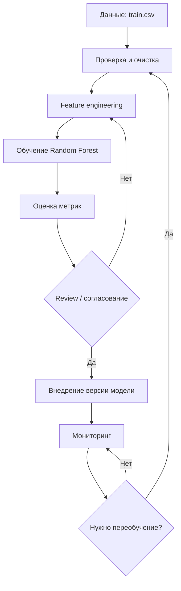

# Model_BPMN: место ML-модели в процессе проекта

Связанный документ: [Model Card](model_card.md).  
Графическая схема: [model_lifecycle.png](bpmn/model_lifecycle.png).

---

## 1. Схема процесса (Markdown / BPMN-style)

Ниже — упрощённая диаграмма жизненного цикла модели оттока клиентов. Она соответствует workflow, отражённому в `docs/bpmn/model_lifecycle.png`.

```text
┌─────────────────┐
│  Источник данных │  data/raw/train.csv
│  (CRM / банк)    │
└────────┬────────┘
         │
         ▼
┌─────────────────┐
│ Проверка и       │  load_data → clean_columns
│ подготовка данных│  (удаление id, CustomerId, Surname)
└────────┬────────┘
         │
         ▼
┌─────────────────┐
│ Feature          │  add_features:
│ engineering      │  AgeGroup, BalanceToSalary,
│                  │  ActiveMultiProduct, SegmentFlag
└────────┬────────┘
         │
         ▼
┌─────────────────┐
│ Обучение модели  │  train_random_forest:
│ (Random Forest)  │  split → HalvingRandomSearchCV
│                  │  → метрики (recall, precision, …)
└────────┬────────┘
         │
         ▼
┌─────────────────┐
│ Оценка и отчёт   │  metrics + сохранение
│                  │  models/churn_random_forest.joblib
└────────┬────────┘
         │
         ▼
┌─────────────────┐     нет
│ Review /         │──────────► доработка данных /
│ согласование     │            признаков / гиперпараметров
│ (GitHub / DS)    │
└────────┬────────┘
         │ да
         ▼
┌─────────────────┐
│ Внедрение        │  использование версии модели
│ (deployment)     │  в аналитике / CRM
└────────┬────────┘
         │
         ▼
┌─────────────────┐
│ Мониторинг       │  качество, дрейф признаков,
│                  │  бизнес-эффект удержания
└────────┬────────┘
         │
         ▼
┌─────────────────┐     нужно
│ Решение о        │──────────► возврат к «Подготовка данных»
│ переобучении     │            / «Обучение»
└─────────────────┘
```

### Mermaid (для просмотра в GitHub / VS Code)



---

## 2. Краткое описание роли модели в процессе

### Какую задачу в процессе решает модель

Модель решает задачу **прогнозирования оттока клиентов банка** (бинарная классификация по целевой переменной `Exited`).  
На этапе после feature engineering она по признакам клиента выдаёт класс и/или вероятность ухода. Этот сигнал используется дальше для приоритизации клиентов в CRM и планирования мероприятий по удержанию.

### Почему для этой задачи целесообразно использовать ML

- Связь признаков (возраст, география, активность, баланс, число продуктов и производные флаги) с оттоком **нелинейна и многофакторна** — правила «если… то…» плохо масштабируются.
- Нужно **ранжирование** клиентов по риску, а не только жёсткие пороги: Random Forest даёт вероятности и устойчив к смешанным типам признаков.
- Есть размеченная историческая выборка (`Exited`), что делает supervised learning естественным выбором.
- Дисбаланс классов и необходимость высокого **recall** хорошо обрабатываются через `class_weight` и подбор гиперпараметров под `scoring="recall"`.

### Какие данные поступают на вход модели

1. **Сырые данные:** `data/raw/train.csv` (или путь, переданный в CLI `--data`).
2. После очистки и feature engineering на вход pipeline подаются:
   - **Числовые:** `Age`, `NumOfProducts`, `Balance`, `BalanceToSalary`, `ActiveMultiProduct`, `SegmentFlag`
   - **Категориальные:** `IsActiveMember`, `Geography`, `Gender`, `AgeGroup`
3. Целевая переменная при обучении: `Exited`.  
   Идентификаторы (`id`, `CustomerId`, `Surname`) **не** подаются в модель.

В проде на inference ожидается тот же набор признаков (после того же `add_features` и preprocessor из pipeline).

### Как результат работы модели используется дальше в процессе

1. **Обучение:** лучшая модель и метрики сохраняются; артефакт — `models/churn_random_forest.joblib`.
2. **Review:** команда проверяет метрики, стабильность и соответствие Model Card; при необходимости возвращается к данным/признакам.
3. **Внедрение:** версия модели используется для batch-скоринга клиентов (или интеграции в CRM): на выходе — вероятность/флаг риска оттока.
4. **Бизнес-использование:** списки клиентов с высоким риском передаются в CRM / retention; модель **не** принимает финальное решение за человека.
5. **Мониторинг и цикл:** при дрейфе данных или падении качества запускается переобучение (возврат к подготовке данных и train).

---

## 3. Связь с Model Card и кодом

| Этап на схеме | Код / документ |
|---------------|----------------|
| Загрузка и очистка | `src/churn_ml/data.py` |
| Feature engineering | `src/churn_ml/features.py` |
| Обучение и метрики | `src/churn_ml/modeling.py`, `train.py` |
| Конфиг признаков и target | `src/churn_ml/config.py` |
| Назначение, метрики, ограничения | [model_card.md](model_card.md) |
| Графическая BPMN-схема | [bpmn/model_lifecycle.png](bpmn/model_lifecycle.png) |

---

## 4. Итог

Модель **Churn Random Forest** стоит в центре ML-цикла проекта: от подготовленных признаков клиентов банка до сигнала риска оттока для CRM. ML оправдан сложностью зависимостей и наличием разметки; вход — согласованный набор числовых и категориальных признаков; выход — вероятность/класс, который используется как рекомендация в процессе удержания и подлежит мониторингу с возможностью переобучения.
