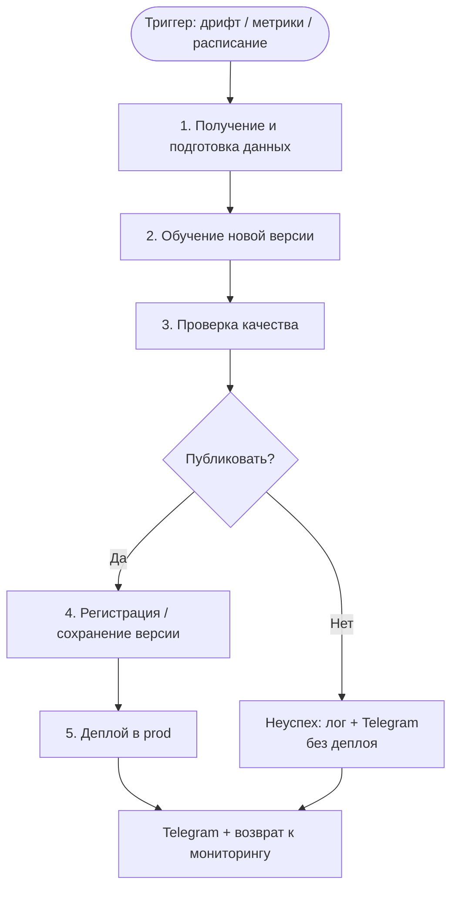

# Model_retrain_BPMN: процесс автоматического переобучения модели

**Проект:** `churn_ml_production` — прогноз оттока клиентов банка (Random Forest, target `Exited`)  
**Связанные документы:** [Model Card](model_card.md) · [Model_BPMN](Model_BPMN.md) · [схема .bpmn](bpmn/churn_retraining_cycle.bpmn)

Документ описывает процесс **от триггера переобучения до развёртывания новой версии** модели (или отказа от публикации).

---

## 1. Схема процесса (Markdown)

```text
┌─────────────────────────────────────────────────────────────────────────────┐
│              Цикл автоматического переобучения Churn RF                      │
└─────────────────────────────────────────────────────────────────────────────┘

  ○ ТРИГГЕР
  │  (дрифт данных / падение метрик / расписание)
  │  → сигнал: «нужно переобучить»
  ▼
  ┌──────────────────────────┐
  │ 1. Получение и           │  Загрузка свежих данных
  │    подготовка данных     │  clean_columns + add_features
  └────────────┬─────────────┘
               │  → DataFrame с признаками и Exited
               ▼
  ┌──────────────────────────┐
  │ 2. Обучение новой        │  train_random_forest
  │    версии модели         │  HalvingRandomSearchCV, scoring=recall
  └────────────┬─────────────┘
               │  → model_v_new.joblib + metrics (recall, precision, f1, auc, ap)
               ▼
  ┌──────────────────────────┐
  │ 3. Проверка качества     │  Сравнение метрик с baseline / prod
  │    (авто + human)        │  User Task: валидация аналитиком
  └────────────┬─────────────┘
               │  → вердикт: Approve / Reject
               ▼
         ◇ Решение о публикации
        ╱              ╲
   нет ╱                ╲ да
      ▼                  ▼
 ┌─────────────┐   ┌──────────────────────────┐
 │ Неуспех     │   │ 4. Регистрация /         │
 │ • Telegram  │   │    сохранение версии     │
 │ • лог       │   │  models/churn_rf_vN.joblib│
 │ • без деплоя│   └────────────┬─────────────┘
 └──────┬──────┘                │  → версия в registry / models/
        │                       ▼
        │              ┌──────────────────────────┐
        │              │ 5. Деплой                │
        │              │  публикация в prod       │
        │              └────────────┬─────────────┘
        │                           │  → модель в эксплуатации
        │                           ▼
        │              ┌──────────────────────────┐
        │              │ Telegram: результат      │
        └─────────────►│ Вернуться к мониторингу  │
                       └──────────────────────────┘
```

### Mermaid (для GitHub)



Графическая BPMN-версия с дорожками: [churn_retraining_cycle.bpmn](bpmn/churn_retraining_cycle.bpmn) (открыть в [bpmn.io](https://demo.bpmn.io/)).

---

## 2. Этапы: что происходит и что передаётся дальше

### Триггер запуска переобучения

| Что происходит | Результат на следующий шаг |
|----------------|----------------------------|
| Система мониторинга фиксирует **data drift** (например PSI > 0.25 по Age, Balance, Geography), **concept drift** или **падение recall/ROC-AUC** на prod; либо срабатывает **расписание** (еженедельный retraining) | Событие Start: «запустить цикл переобучения» |

В BPMN: **Start Event** «Дрифт / расписание».

---

### 1. Получение и подготовка новых данных

| Что происходит | Результат на следующий шаг |
|----------------|----------------------------|
| Загрузка актуального `train.csv` (или среза из хранилища). Удаление идентификаторов (`id`, `CustomerId`, `Surname`). Feature engineering: `AgeGroup`, `BalanceToSalary`, `ActiveMultiProduct`, `SegmentFlag` | Таблица признаков X и целевая переменная `Exited`, готовые к обучению |

Код: `src/churn_ml/data.py`, `features.py`.

---

### 2. Обучение новой версии модели

| Что происходит | Результат на следующий шаг |
|----------------|----------------------------|
| Stratified train/test split. Pipeline: impute → scale / one-hot → RandomForest. Подбор гиперпараметров через `HalvingRandomSearchCV` (`scoring="recall"`). Расчёт метрик на test | Артефакт `model_v_new.joblib` + словарь метрик: recall, precision, f1, roc_auc, average_precision, best_params |

Код: `src/churn_ml/train.py`, `modeling.py`.  
Команда:  
`poetry run python -m churn_ml.train --data data/raw/train.csv --model-out models/churn_rf_vN.joblib`

---

### 3. Проверка качества модели

| Что происходит | Результат на следующий шаг |
|----------------|----------------------------|
| **Авто:** сравнение метрик новой модели с текущей prod (и/или baseline). **Human-in-the-loop:** User Task «Валидация модели» — аналитик смотрит AUC, Recall, F1, feature importance и нажимает Approve / Reject | Вердикт **Approve** → переход к решению о публикации; **Reject** → ветка неуспеха |

На шлюзе публикации используются **несколько метрик** (не только AUC):

```text
IF (AUC_new > AUC_prod)
   AND (Recall_new >= Recall_prod - 0.02)
   AND (F1_new >= F1_prod - 0.02)
THEN кандидат на публикацию
ELSE не публиковать
```

---

### Принятие решения о публикации новой версии

| Условие | Действие |
|---------|----------|
| Approve **и** новая модель лучше prod по правилам выше | Идём в регистрацию и деплой |
| Reject **или** новая не лучше prod | Ветка **неуспеха**: без деплоя |

---

### 4. Регистрация / сохранение новой версии

| Что происходит | Результат на следующий шаг |
|----------------|----------------------------|
| Сохранение артефакта с версией (`models/churn_rf_vN.joblib` или model registry). Фиксация метрик, seed, пути к данным, ссылки на Model Card | Именованная версия модели, готовая к выкладке в prod |

---

### 5. Деплой модели

| Что происходит | Результат на следующий шаг |
|----------------|----------------------------|
| Замена (или canary) prod-артефакта на новую версию. При batch-скоринге — обновление пути к `joblib` в пайплайне CRM | Новая модель **в эксплуатации**; скоринг клиентов идёт по vN |

---

### Действия при неуспешном прохождении проверок

| Ситуация | Действия |
|----------|----------|
| Аналитик отклонил модель | Service Task: уведомление в **Telegram** («модель отклонена» + комментарий). Прод **не** меняется. Лог решения. Возврат к мониторингу |
| Метрики новой модели хуже prod | То же: оставить prod-модель, Telegram с результатом сравнения, лог, мониторинг |
| Повторные неудачи подряд | Ограничение (например max 3 retraining подряд) → эскалация / User Task «разобрать причину дрифта», чтобы не крутить пустой цикл |

---

## 3. Сводка: от триггера до эксплуатации

| Этап | Вход | Выход |
|------|------|-------|
| Триггер | Сигнал дрифта / расписание | Старт цикла |
| Данные | Сырой CSV | X, y после FE |
| Обучение | X, y | model_v_new + metrics |
| Проверка качества | model_v_new, metrics, prod baseline | Approve / Reject |
| Решение | Approve + «новая лучше» | Да → регистрация; Нет → неуспех |
| Регистрация | model_v_new | Версия vN в `models/` / registry |
| Деплой | vN | Модель в prod |
| Неуспех | Reject или «не лучше» | Прод без изменений, Telegram, мониторинг |

**Когда модель попадает в эксплуатацию:** только если (1) аналитик одобрил валидацию и (2) новая версия не хуже текущей prod по согласованным метрикам (AUC + Recall + F1).

---

## 4. Связь с кодом и артефактами проекта

| Этап | Файл / артефакт |
|------|-----------------|
| Данные | `src/churn_ml/data.py`, `features.py`, `data/raw/train.csv` |
| Обучение | `src/churn_ml/train.py`, `modeling.py`, `config.py` |
| Артефакт модели | `models/churn_random_forest.joblib` (или `churn_rf_vN.joblib`) |
| Описание модели | [model_card.md](model_card.md) |
| BPMN с дорожками | [churn_retraining_cycle.bpmn](bpmn/churn_retraining_cycle.bpmn), [Model_BPMN.md](Model_BPMN.md) |

---

## 5. Что сдавать

- Ссылка на файл в репозитории: **`docs/Model_retrain_BPMN.md`**
- По схеме и таблице этапов должно быть ясно:
  - **что запускает** переобучение (дрифт / метрики / расписание);
  - **какие проверки** проходит новая модель (метрики + User Task);
  - **при каких условиях** она попадает в эксплуатацию (Approve + лучше prod).
